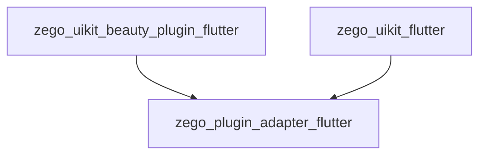
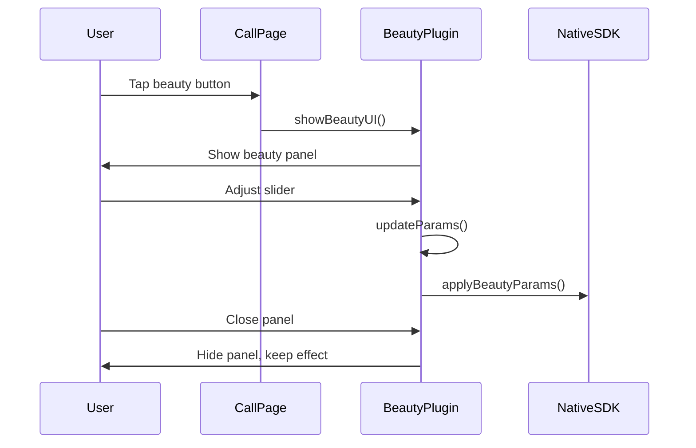
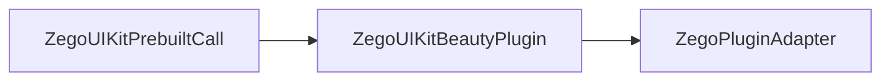

# ZegoUIKitBeautyPlugin Architecture

> Beauty plugin - implements ZegoBeautyPluginInterface

## Overview

`zego_uikit_beauty_plugin_flutter` is the **beauty plugin implementation** that implements `ZegoBeautyPluginInterface` defined in `ZegoPluginAdapter`:

- Beauty parameter configuration (smooth, whitening, sharpen, rosy)
- Advanced beauty effects (facelift, big eyes)
- Makeup effects
- Stickers/filters

**Depends on**: `zego_plugin_adapter_flutter` (interface definition)

## Package Relationship



## Core Class: ZegoUIKitBeautyPlugin

Main entry singleton:

```dart
class ZegoUIKitBeautyPlugin implements ZegoBeautyPluginInterface {
  factory ZegoUIKitBeautyPlugin() => instance;

  @override
  ZegoUIKitPluginType getPluginType() => ZegoUIKitPluginType.beauty;
}
```

## Quick Start

### 1. Install Plugin

```dart
// On app startup
ZegoPluginAdapterImpl().installPlugins([
  ZegoUIKitBeautyPlugin(),
]);
```

### 2. Use in Call

```dart
ZegoUIKitPrebuiltCall(
  appID: yourAppID,
  appSign: yourAppSign,
  userID: userID,
  userName: userName,
  callID: callID,
  config: ZegoUIKitPrebuiltCallConfig.oneOnOneVideoCall(),
  plugins: [ZegoUIKitBeautyPlugin()],  // Add plugin
  config: ZegoUIKitPrebuiltCallConfig.oneOnOneVideoCall()
    ..beauty = ZegoBeautyPluginConfig()
    ..bottomMenuBarConfig(
      buttons: [
        ZegoCallMenuBarButtonName.beautyEffectButton,  // Add beauty button
        ZegoCallMenuBarButtonName.toggleMicrophone,
        ZegoCallMenuBarButtonName.toggleCamera,
        ZegoCallMenuBarButtonName.hangUp,
      ],
    ),
)
```

## Beauty Types

```dart
enum ZegoBeautyType {
  smooth,    // Smooth
  whiten,    // Whitening
  rosy,      // Rosy
  sharpen,   // Sharpen
  facelift,  // Facelift
  bigEye,    // Big eyes
}
```

## API Usage

### Initialize

```dart
await ZegoUIKitBeautyPlugin().init(
  appID: yourAppID,
  appSign: yourAppSign,
);
```

### Set Beauty Parameters

```dart
// Single params
await ZegoUIKitBeautyPlugin().setBeautyParams(
  ZegoBeautyParams(
    smoothLevel: 50,    // Smooth 0-100
    whitenLevel: 30,   // Whitening 0-100
    rosyLevel: 20,     // Rosy 0-100
    sharpenLevel: 10,  // Sharpen 0-100
  ),
);

// Using config list
await ZegoUIKitBeautyPlugin().setBeautyParams([
  ZegoBeautyParamConfig(
    type: ZegoBeautyType.smooth,
    intensity: 0.5,  // 0.0 - 1.0
  ),
  ZegoBeautyParamConfig(
    type: ZegoBeautyType.whitening,
    intensity: 0.3,
  ),
]);
```

### Enable/Disable Beauty

```dart
// Enable beauty
await ZegoUIKitBeautyPlugin().enableBeauty(true);

// Disable beauty
await ZegoUIKitBeautyPlugin().enableBeauty(false);

// Check if enabled
bool isEnabled = ZegoUIKitBeautyPlugin().isBeautyEnabled;
```

### Show Beauty UI

```dart
// Show beauty panel
ZegoUIKitBeautyPlugin().showBeautyUI(context);

// Custom UI config
ZegoUIKitBeautyPlugin().setConfig(
  ZegoBeautyPluginConfig(
    uiConfig: ZegoBeautyPluginUIConfig(
      backgroundColor: Colors.black,
      selectedIconBorderColor: Colors.red,
      sliderThumbColor: Colors.white,
      sliderActiveColor: Colors.pink,
    ),
  ),
);
```

### Get/Apply Presets

```dart
// Get preset list
final presets = ZegoUIKitBeautyPlugin().getPresets();

// Apply preset
await ZegoUIKitBeautyPlugin().applyPreset('natural');

// Save current as preset
await ZegoUIKitBeautyPlugin().saveAsPreset('my_preset');
```

## Beauty Effects UI Flow



## Directory Structure

```
lib/
└── zego_uikit_beauty_plugin.dart    # Main entry

lib/src/
├── beauty_plugin.dart          # Main entry
├── config.dart               # Config
├── define.dart              # Defines
├── enums.dart               # Enums
├── errors.dart              # Errors
├── interface.dart           # Interface
├── ui_config.dart           # UI config
├── components/              # UI components
│   ├── beauty_slider.dart   # Beauty slider
│   ├── beauty_panel.dart    # Beauty panel
│   └── ...
├── internal/                # Internal implementation
│   ├── core.dart
│   └── utils.dart
└── method_channel.dart      # Platform channel
```

## Configuration Classes

### ZegoBeautyParams

```dart
class ZegoBeautyParams {
  double smoothLevel;      // Smooth level (0-100)
  double whitenLevel;      // Whitening level (0-100)
  double rosyLevel;        // Rosy level (0-100)
  double sharpenLevel;     // Sharpen level (0-100)
}
```

### ZegoBeautyPluginConfig

```dart
class ZegoBeautyPluginConfig {
  /// Whether to enable beauty
  bool enabled;

  /// Default beauty params
  ZegoBeautyParams? defaultParams;

  /// UI config
  ZegoBeautyPluginUIConfig? uiConfig;
}
```

### ZegoBeautyPluginUIConfig

```dart
class ZegoBeautyPluginUIConfig {
  Color backgroundColor;           // Background color
  Color selectedIconBorderColor;   // Selected icon border color
  Color sliderThumbColor;          // Slider thumb color
  Color sliderActiveColor;         // Slider active color
  double panelHeight;              // Panel height
}
```

## Integration with Prebuilt Call



```dart
// Complete example
class MyCallPage extends StatelessWidget {
  @override
  Widget build(BuildContext context) {
    return ZegoUIKitPrebuiltCall(
      appID: yourAppID,
      appSign: yourAppSign,
      userID: currentUserID,
      userName: currentUserName,
      callID: targetCallID,
      plugins: [ZegoUIKitBeautyPlugin()],  // Register plugin
      config: ZegoUIKitPrebuiltCallConfig.oneOnOneVideoCall()
        ..beauty = ZegoBeautyPluginConfig(
          enabled: true,
          defaultParams: ZegoBeautyParams(
            smoothLevel: 30,
            whitenLevel: 20,
          ),
        )
        ..bottomMenuBarConfig(
          buttons: [
            ZegoCallMenuBarButtonName.beautyEffectButton,  // Show beauty button
            ZegoCallMenuBarButtonName.toggleMicrophone,
            ZegoCallMenuBarButtonName.toggleCamera,
            ZegoCallMenuBarButtonName.hangUp,
          ],
        ),
    );
  }
}
```

## Common Issues

### 1. iOS Beauty Not Working

Ensure resources are properly configured:
```
ios/Runner/Assets/  # Beauty resource files
```

### 2. Beauty Effect Not Visible

Adjust parameter range:
```dart
// Increase parameters appropriately
ZegoBeautyParams(
  smoothLevel: 60,   // Default 50
  whitenLevel: 40,   // Default 30
)
```

### 3. Performance Issues

Beauty at high resolution is performance-intensive:
- Lower video resolution
- Reduce number of simultaneous beauty types

## Related Documentation

- [ZegoPluginAdapter Architecture](../zego_plugin_adapter_flutter/ARCHITECTURE.md)
- [ZegoUIKitPrebuiltCall Architecture](../zego_uikit_prebuilt_call_flutter/ARCHITECTURE.md)
