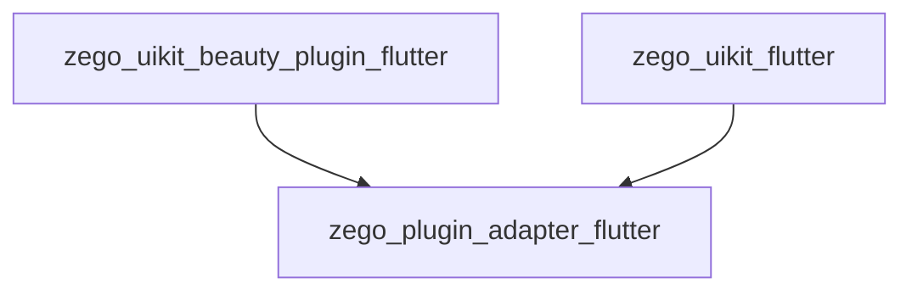
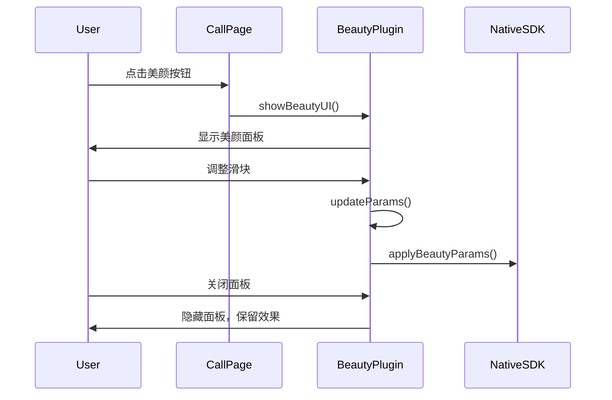
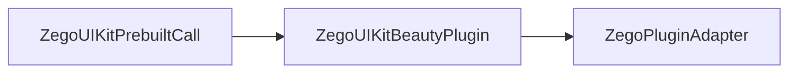

# ZegoUIKitBeautyPlugin Architecture

> 美颜插件 - 实现 ZegoBeautyPluginInterface

## Overview

`zego_uikit_beauty_plugin_flutter` 是**美颜插件实现**，实现了 `ZegoPluginAdapter` 中定义的 `ZegoBeautyPluginInterface`：

- 美颜参数配置（磨皮、美白、锐化、红润）
- 高级美颜效果（瘦脸、大眼）
- 妆容效果
- 贴纸/滤镜

**依赖**: `zego_plugin_adapter_flutter` (定义接口)

## Package Relationship



## Core Class: ZegoUIKitBeautyPlugin

主入口单例：

```dart
class ZegoUIKitBeautyPlugin implements ZegoBeautyPluginInterface {
  factory ZegoUIKitBeautyPlugin() => instance;

  @override
  ZegoUIKitPluginType getPluginType() => ZegoUIKitPluginType.beauty;
}
```

## Quick Start

### 1. 安装插件

```dart
// 在应用启动时
ZegoPluginAdapterImpl().installPlugins([
  ZegoUIKitBeautyPlugin(),
]);
```

### 2. 在通话中使用

```dart
ZegoUIKitPrebuiltCall(
  appID: yourAppID,
  appSign: yourAppSign,
  userID: userID,
  userName: userName,
  callID: callID,
  config: ZegoUIKitPrebuiltCallConfig.oneOnOneVideoCall(),
  plugins: [ZegoUIKitBeautyPlugin()],  // 添加插件
  config: ZegoUIKitPrebuiltCallConfig.oneOnOneVideoCall()
    ..beauty = ZegoBeautyPluginConfig()
    ..bottomMenuBarConfig(
      buttons: [
        ZegoCallMenuBarButtonName.beautyEffectButton,  // 添加美颜按钮
        ZegoCallMenuBarButtonName.toggleMicrophone,
        ZegoCallMenuBarButtonName.toggleCamera,
        ZegoCallMenuBarButtonName.hangUp,
      ],
    ),
)
```

## Beauty Types

```dart
enum ZegoBeautyType {
  smooth,    // 磨皮
  whiten,    // 美白
  rosy,      // 红润
  sharpen,   // 锐化
  facelift,  // 瘦脸
  bigEye,    // 大眼
}
```

## API Usage

### 初始化

```dart
await ZegoUIKitBeautyPlugin().init(
  appID: yourAppID,
  appSign: yourAppSign,
);
```

### 设置美颜参数

```dart
// 单个参数
await ZegoUIKitBeautyPlugin().setBeautyParams(
  ZegoBeautyParams(
    smoothLevel: 50,    // 磨皮 0-100
    whitenLevel: 30,     // 美白 0-100
    rosyLevel: 20,      // 红润 0-100
    sharpenLevel: 10,   // 锐化 0-100
  ),
);

// 使用配置列表
await ZegoUIKitBeautyPlugin().setBeautyParams([
  ZegoBeautyParamConfig(
    type: ZegoBeautyType.smooth,
    intensity: 0.5,  // 0.0 - 1.0
  ),
  ZegoBeautyParamConfig(
    type: ZegoBeautyType.whitening,
    intensity: 0.3,
  ),
]);
```

### 开启/关闭美颜

```dart
// 开启美颜
await ZegoUIKitBeautyPlugin().enableBeauty(true);

// 关闭美颜
await ZegoUIKitBeautyPlugin().enableBeauty(false);

// 检查是否启用
bool isEnabled = ZegoUIKitBeautyPlugin().isBeautyEnabled;
```

### 显示美颜 UI

```dart
// 显示美颜面板
ZegoUIKitBeautyPlugin().showBeautyUI(context);

// 自定义 UI 配置
ZegoUIKitBeautyPlugin().setConfig(
  ZegoBeautyPluginConfig(
    uiConfig: ZegoBeautyPluginUIConfig(
      backgroundColor: Colors.black,
      selectedIconBorderColor: Colors.red,
      sliderThumbColor: Colors.white,
      sliderActiveColor: Colors.pink,
    ),
  ),
);
```

### 获取/设置预设

```dart
// 获取预设列表
final presets = ZegoUIKitBeautyPlugin().getPresets();

// 应用预设
await ZegoUIKitBeautyPlugin().applyPreset('natural');

// 保存当前设置为预设
await ZegoUIKitBeautyPlugin().saveAsPreset('my_preset');
```

## Beauty Effects UI Flow



## Directory Structure

```
lib/
└── zego_uikit_beauty_plugin.dart    # 主入口

lib/src/
├── beauty_plugin.dart          # 主入口
├── config.dart               # 配置
├── define.dart              # 定义
├── enums.dart               # 枚举
├── errors.dart              # 错误
├── interface.dart           # 接口
├── ui_config.dart           # UI 配置
├── components/              # UI 组件
│   ├── beauty_slider.dart   # 美颜滑块
│   ├── beauty_panel.dart    # 美颜面板
│   └── ...
├── internal/                # 内部实现
│   ├── core.dart
│   └── utils.dart
└── method_channel.dart      # 平台通道
```

## Configuration Classes

### ZegoBeautyParams

```dart
class ZegoBeautyParams {
  double smoothLevel;      // 磨皮级别 (0-100)
  double whitenLevel;      // 美白级别 (0-100)
  double rosyLevel;         // 红润级别 (0-100)
  double sharpenLevel;      // 锐化级别 (0-100)
}
```

### ZegoBeautyPluginConfig

```dart
class ZegoBeautyPluginConfig {
  /// 是否启用美颜
  bool enabled;

  /// 默认美颜参数
  ZegoBeautyParams? defaultParams;

  /// UI 配置
  ZegoBeautyPluginUIConfig? uiConfig;
}
```

### ZegoBeautyPluginUIConfig

```dart
class ZegoBeautyPluginUIConfig {
  Color backgroundColor;           // 背景色
  Color selectedIconBorderColor;   // 选中图标边框色
  Color sliderThumbColor;          // 滑块拇指颜色
  Color sliderActiveColor;         // 滑块已滑过颜色
  double panelHeight;              // 面板高度
}
```

## Integration with Prebuilt Call



```dart
// 完整示例
class MyCallPage extends StatelessWidget {
  @override
  Widget build(BuildContext context) {
    return ZegoUIKitPrebuiltCall(
      appID: yourAppID,
      appSign: yourAppSign,
      userID: currentUserID,
      userName: currentUserName,
      callID: targetCallID,
      plugins: [ZegoUIKitBeautyPlugin()],  // 注册插件
      config: ZegoUIKitPrebuiltCallConfig.oneOnOneVideoCall()
        ..beauty = ZegoBeautyPluginConfig(
          enabled: true,
          defaultParams: ZegoBeautyParams(
            smoothLevel: 30,
            whitenLevel: 20,
          ),
        )
        ..bottomMenuBarConfig(
          buttons: [
            ZegoCallMenuBarButtonName.beautyEffectButton,  // 工具栏显示美颜按钮
            ZegoCallMenuBarButtonName.toggleMicrophone,
            ZegoCallMenuBarButtonName.toggleCamera,
            ZegoCallMenuBarButtonName.hangUp,
          ],
        ),
    );
  }
}
```

## Common Issues

### 1. iOS 美颜不工作

确保资源文件已正确配置：
```
ios/Runner/Assets/  # 美颜资源文件
```

### 2. 美颜效果不明显

调整参数范围：
```dart
// 适当提高参数
ZegoBeautyParams(
  smoothLevel: 60,   // 默认 50
  whitenLevel: 40,   // 默认 30
)
```

### 3. 性能问题

高分辨率下美颜较耗性能：
- 降低视频分辨率
- 减少同时开启的美颜类型

## Related Documentation

- [ZegoPluginAdapter Architecture](../zego_plugin_adapter_flutter/ARCHITECTURE.md)
- [ZegoUIKitPrebuiltCall Architecture](../zego_uikit_prebuilt_call_flutter/ARCHITECTURE.md)